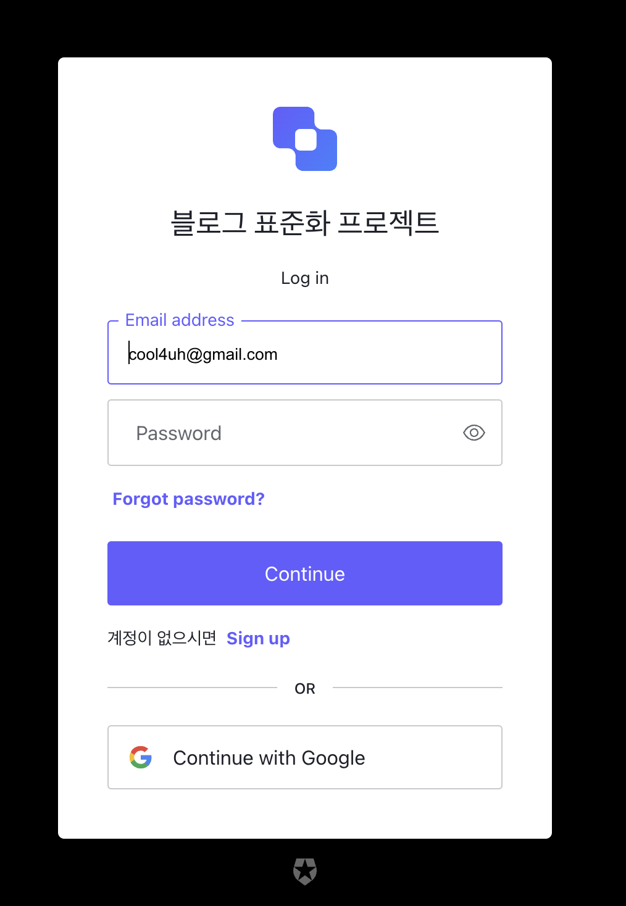

# 프로젝트명: 블로그 자동화 (blog-generator)
> ChatGPT Open API를 이용하여 SEO-friendly 블로그 컨텐츠를 자동 생성

토픽과 키워드에 적합한 블로그 컨텐츠를 생성해 줍니다.


[Next JS & Open AI / GPT: Next-generation]


## 설치 방법

OS X & 리눅스:

```sh
npm install book-matching --save
```

윈도우:

```sh
edit autoexec.bat
```

## 사용 예제




