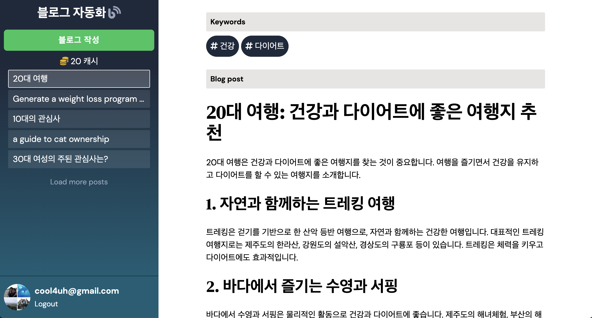

# 프로젝트명: 블로그 자동화 (blog-generator)
> ChatGPT Open API를 이용하여 SEO-friendly 블로그 컨텐츠를 자동 생성

토픽과 키워드에 적합한 블로그 컨텐츠를 생성해 줍니다.


[Next JS & Open AI / GPT: Next-generation]


<svg role="img" viewBox="0 0 24 24" xmlns="http://www.w3.org/2000/svg"><title>Auth0</title><path d="M21.98 7.448L19.62 0H4.347L2.02 7.448c-1.352 4.312.03 9.206 3.815 12.015L12.007 24l6.157-4.552c3.755-2.81 5.182-7.688 3.815-12.015l-6.16 4.58 2.343 7.45-6.157-4.597-6.158 4.58 2.358-7.433-6.188-4.55 7.63-.045L12.008 0l2.356 7.404 7.615.044z"/></svg>


## 설치 방법

OS X & 리눅스:

```sh
npm install book-matching --save
```

윈도우:

```sh
edit autoexec.bat
```

## 사용 예제



